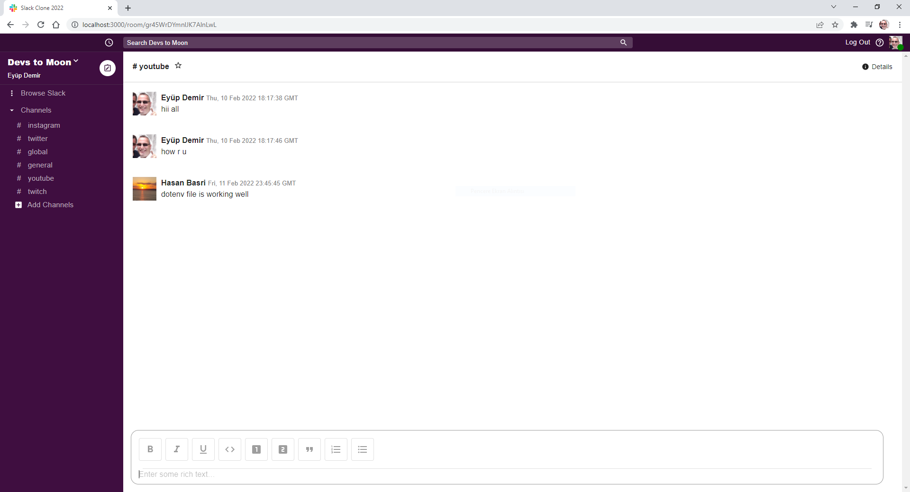

# React Slack Clone 2022

This project powered by React and Material-UI (MUI), and Slack's new design for 2022 was used.



## Features

- 📝 Adding public chat rooms
- 📡 Realtime sending and receiving of messages
- 📝 Google authentication

## Usage

To run the application locally; clone the repo, install dependencies and run the app.

```
$ git clone https://github.com/mithderler/slack-clone.git
$ cd slack-clone
$ npm install
$ npm start
```

Runs the app in the development mode.\
Open [http://localhost:3000](http://localhost:3000) to view it in your browser.

The page will reload when you make changes.\
You may also see any lint errors in the console.
